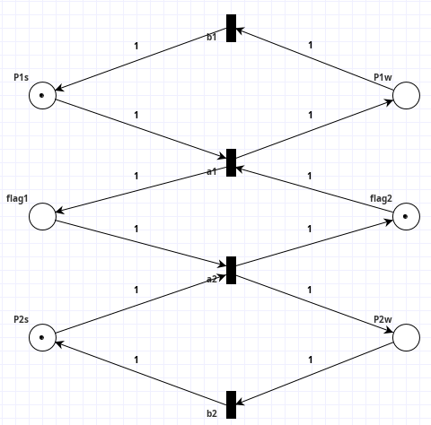
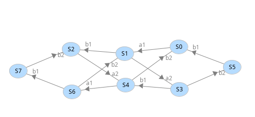
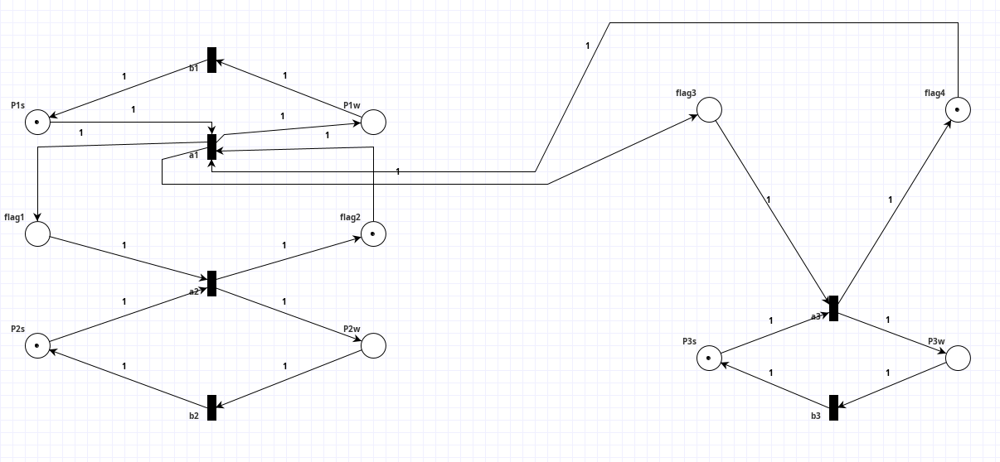
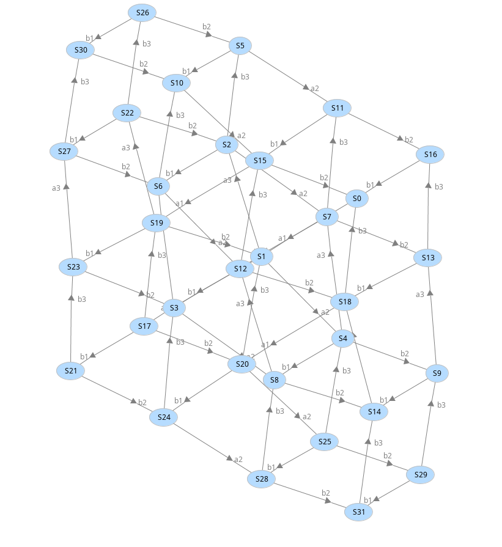

# Milner's scheduler (Esparza/Meyer TUM)

Model for PIPE can be found in _milners_scheduler.xml_, whose diagram is shown below, together with it's reachability graph.

{height=35%}

{height=30%}

## Comments on the model

Thanks to the reachability graph we can see that the net is bounded and live, and that the conditions of the problem are satisfied (e.g. an agent can't start again if the other agent has not done a run in the same iteration, etc.).

## Questions

1. (Model above)

2. How many reachable markings does the Petri net have?

    - By looking at the reachability graph shown above, we see that there are at most 8 markings.

3. How can this solution be generalized to any number of $n$ agents?

    - For $n$ agents, for each agent the model requires an independent process with: 2 transitions, $a_n$ and $b_n$; and two states, $P_ns$ (process $n$ is _stopped_) and $P_nw$ (process $n$ is _working_).
    - Then, for each agent, 2 flag places are required as in the model shown to ensure they won't start again their run before all of them have done a run in such iteration, so the system wait is modelled as returning to $M_0$ (the initial marking).
    - The idea would be to follow the scheme above for $n=2$ but doing exactly the same for each agent considered; as with $n=3$ we would have 2 pairs of flags, then we would build the same scheme followed in the model above ($n=2$ with $\text{flag}_1$ and $\text{flag}_2$) but for $P_1$ - $P_2$ (already in model above) and $P_1$ - $P_3$ (which something like $\text{flag}_3$ and $\text{flag}_4$). This will lead the system to return to $M_0$ (the initial marking) once all of them would've performed a run.
    - An image is shown below with an example of a system like this.

4. How does the number of reachable markings grow as $n$ increases?

    - We see thanks to the reachability graph that the number of markings for $2$ agents is $8$, so it is growing at $2^{2n-1}$ factor. Spelled like this is subtle to see, but the easiest way of finding such pattern is modelling the case with $n=3$, which has already been shown, and the generate its reachability graph.
    - A tough job is to count the number of markings in such reachability graph (below), but it's $32$ ($=2^{2\times3-1}$).
    - If we modify the system for $n=3$ and add one more agent, which is something easily achievable (just 4 states, 2 transitions and 6 arcs required per agent), generate the R.G. and count the states, we would see that there'll be $128$ markings ($=2^{2\times4-1}$).

{height=70%}