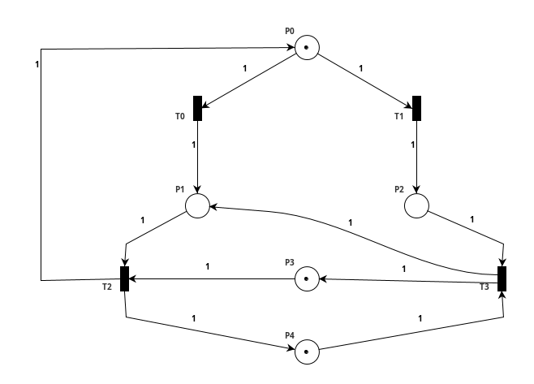
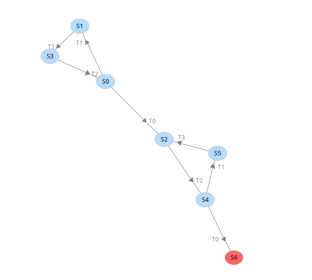
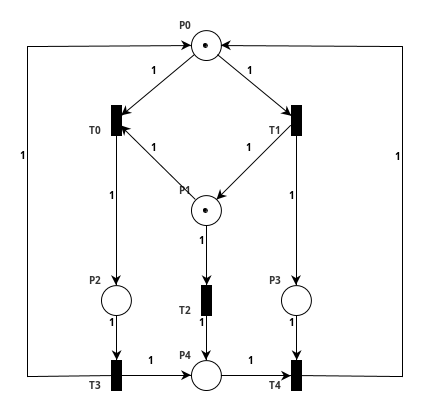
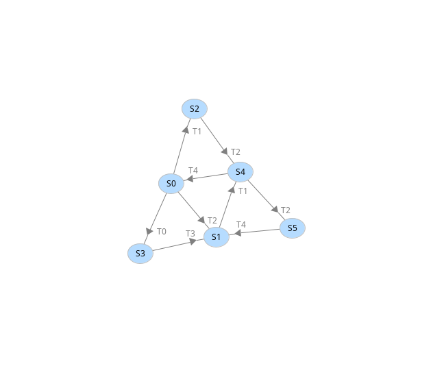
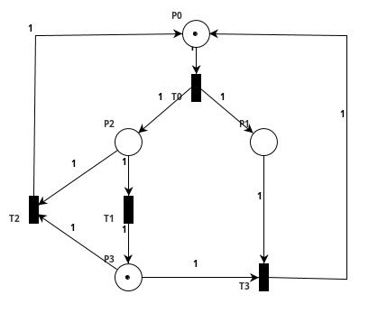
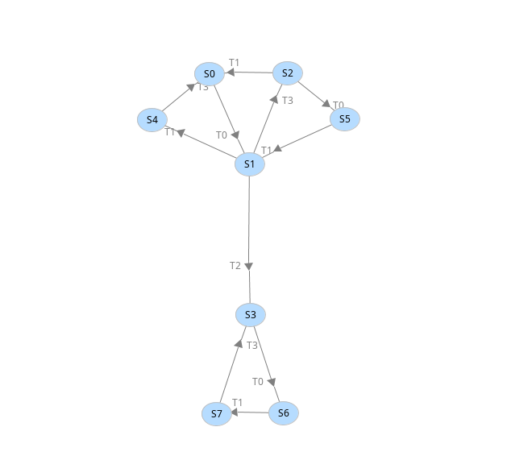

# Properties of Petri nets

For answering the questions I'll be using the reachability graph generated with PIPE after modelling the nets in this tool.

## Net A

{width=50%}
{width=50%}

We can notice that there are these subsets of markings to follow. Starting in S0:
    1. T1$\rightarrow$T3$\rightarrow$T2 -$\rightarrow$ back to S0
    2. T0$\rightarrow$T2$\rightarrow$T1$\rightarrow$T3 $\rightarrow$ to S2
       - From S2:
           1. T2$\rightarrow$T1$\rightarrow$T3
           2. T2$\rightarrow$T0$\rightarrow$ DEADLOCK

### Boundedness

By executing the transitions T1$\rightarrow$T3$\rightarrow$T2 infinitely there are at most 2 tokens in P3. By executing T0$\rightarrow$T2$\rightarrow$T1$\rightarrow$T3$\rightarrow$T2$\rightarrow$T1$\rightarrow$T3... there are at most 2 tokens in P4. Hence we conclude the net is bounded.

### Liveness

Since there are subsets of markings and since the transition T0 is enabled the first time then some markings won't be reached again we say it's not live.

### Deadlock-freedom

Since there is a deadlock in the reachability graph it's not deadlock-free.

## Net B

{width=50%}
{width=50%}

### Boundedness

Since at first we can execute any of T0, T1 or T2 and any marking will be reachable independently of the set of transitions chosen and our initial marking is S0, we take the following transitions.

1. Transitions to be fired to reach S4 from S0: T0 $\rightarrow$ T3 $\rightarrow$ T1 or T1 $\rightarrow$ T2. Both 1-bounded.
2. Transitions to reach S4 from S4: T4 $\rightarrow$ T2 $\rightarrow$ T1 or T2 $\rightarrow$ T4 $\rightarrow$ T1. First 1-bounded and the second one 2-bounded.

From marking S4 is trivial reach the initial marking, so we conclude it's 2-bounded.

### Liveness

Since any transition can be fired again in the future independently of the set of transitions chosen to be fired we conclude the net is live.

### Deadlock-freedom

We can see in the reachability graph that there are no deadlocks, so it's deadlock free.

## Net C

{width=50%}
{width=50%}

### Boundedness

The posible actions that keeps the execution inside the upper subset of markings consists in not firing T2 (so then any transition fireable from the current marking except this), and this execution is 2-bounded. Once we fire T2, again the net is 2-bounded.

We can say that the net is bounded

### Liveness

The reachability graph shows the two subsets of markings so the net is not live.

### Deadlock-freedom

Again, through the reachability graph we can see that there are no deadlocks so it's deadlock-free.